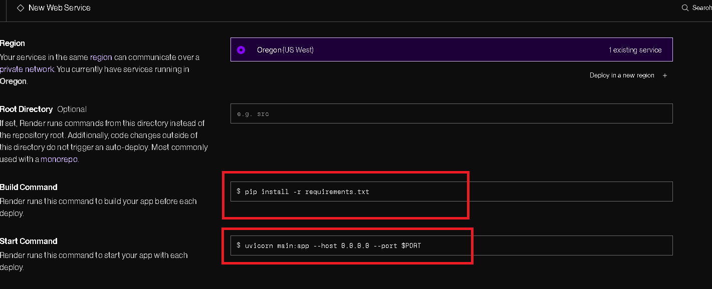
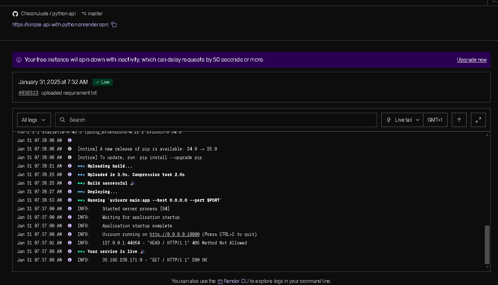
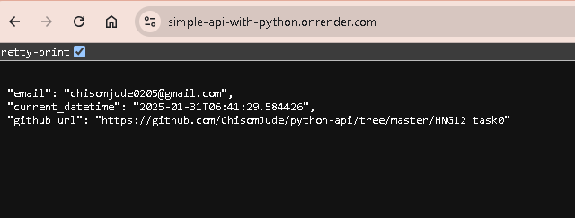

# Deploying a simple API using Fast API
This is project is a begineer guide to FastAPI ( Python Framefork )
Courtesy of HNG12

## Set Up your Environment
Set Up Python and FastAPI

- [x] install Python and ensure Python is running

```
python --version

```
- [x] On your project directory, create a virtual environment

```
python -m venv hngtask0

```

- [x] Activate VENV , (not pushed to github)

```
 hngtask0\Scripts\activate 

```

- [x] On your project directory, create your project file - main.py
> write your code

- [x] While VENV is active, install fastapi and requirement.txt

```
pip install fastapi[all]
pip freeze > requirements.txt
```

## How to Run the App Locally
- [x] Run the app

```
uvicorn main:app --host 0.0.0.0 --port 8000

```

- [x] View the API on http://localhost:8080

## Deployment to Render.com
- [x] Navigate to render.com and create a project , add a new web service, connect to your code repository. 
- [x] Enter your build command - `pip install requirement.txt`
- [x] Enter your start command - `uvicorn main:app --host 0.0.0.0 --port $PORT `

- [x] On deployment, the live tail (log) will show if you have error or success deploay



## API Documentation
This simple API is deployed and  available using the url generate by render 

#### Base URL-
 https://simple-api-with-python.onrender.com



#### Endpoint
**GET** /

#### Request
 - [x] No parameters needed

 #### Response


### Hire Developers
 Visit the link [to Hire Python Developers](https://hng.tech/hire/python-developers)